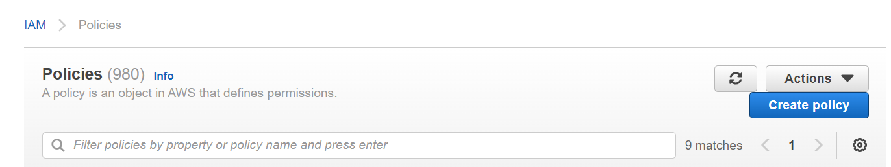
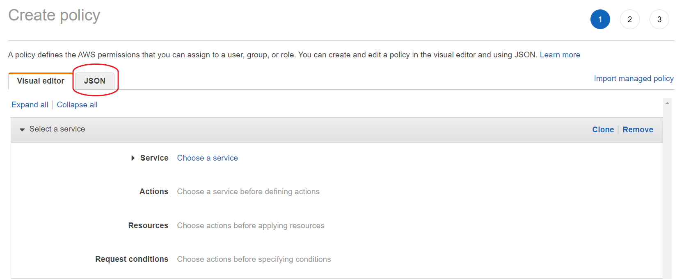
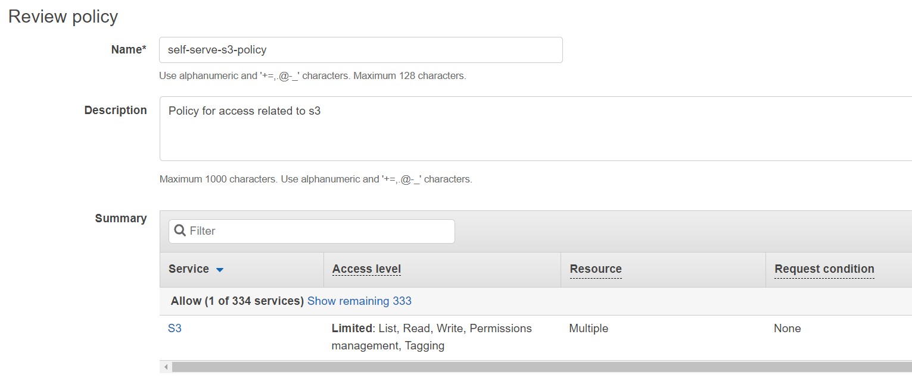
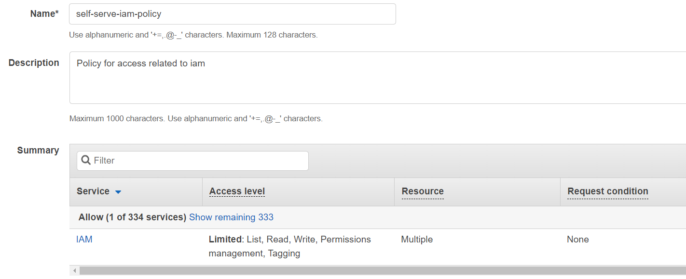
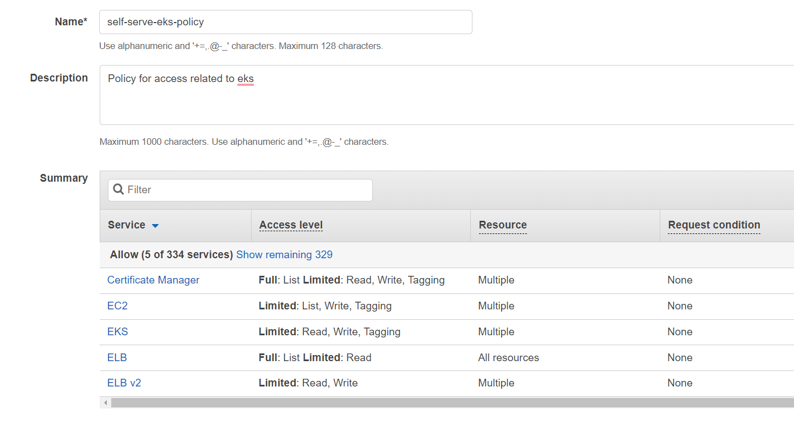
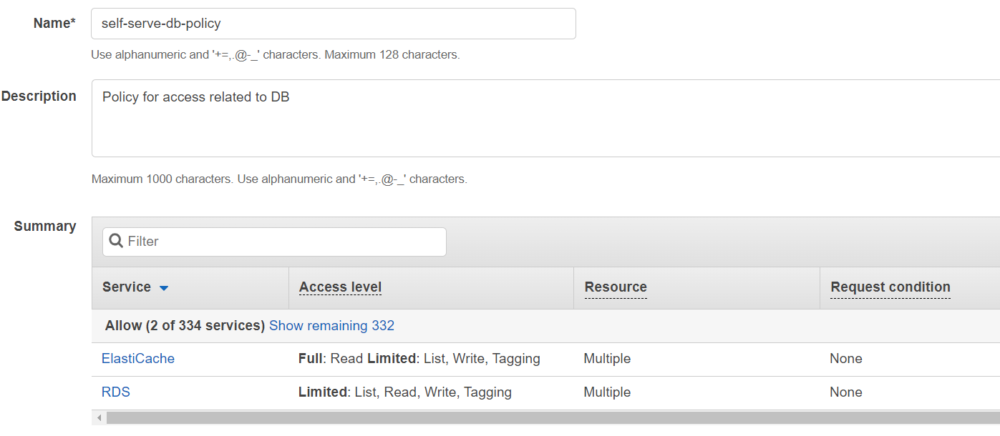
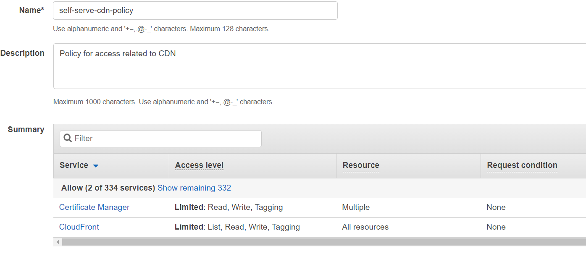
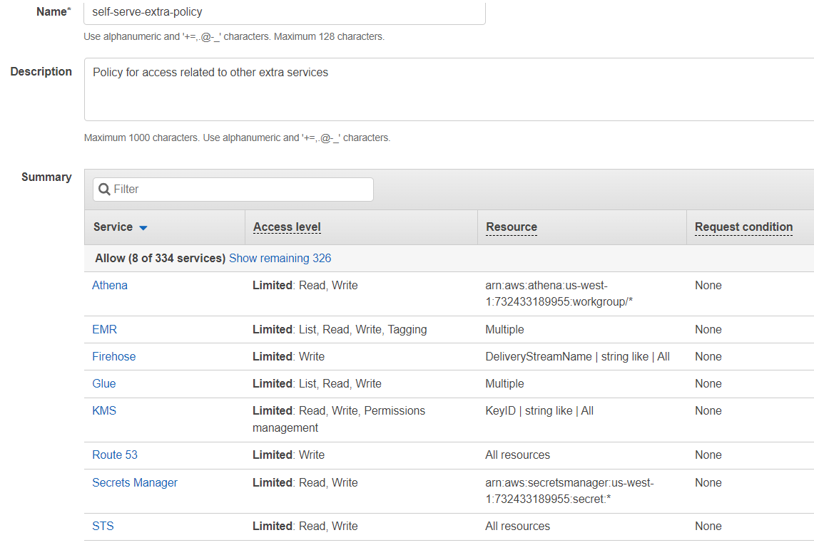

# Policies

By default any user created in AWS doesn't have any permissions. We need to create some policies so that we can allow the user to perform certain actions in AWS.

## Creating IAM policy
1. Go the AWS console and click on **IAM**.
2. Go to **Policies** and click on **Create Policy**. 
3. We will create below polices in order for blotout user to deploy all the required resources.
4. Before beginning the creation of policy we must have the **organization name**, **Env name**, **Region** and your **Account ID** ready with you. For more information on this see [Introduction](../../introudction.md).

### Policy 1: Policy for access related to s3
1. Click on **JSON** to create the policy based on JSON document. 
2. Paste the following in the text box by replacing its original content.
    ```
    {
        "Statement": [
            {
                "Action": [
                    "s3:RestoreObject",
                    "s3:PutObjectTagging",
                    "s3:PutObjectAcl",
                    "s3:PutObject",
                    "s3:PutLifecycleConfiguration",
                    "s3:PutEncryptionConfiguration",
                    "s3:PutBucketWebsite",
                    "s3:PutBucketTagging",
                    "s3:PutBucketPublicAccessBlock",
                    "s3:PutBucketPolicy",
                    "s3:PutBucketAcl",
                    "s3:ListBucketVersions",
                    "s3:ListBucket",
                    "s3:GetReplicationConfiguration",
                    "s3:GetObjectVersion",
                    "s3:GetObject",
                    "s3:GetLifecycleConfiguration",
                    "s3:GetEncryptionConfiguration",
                    "s3:GetBucketWebsite",
                    "s3:GetBucketVersioning",
                    "s3:GetBucketTagging",
                    "s3:GetBucketRequestPayment",
                    "s3:GetBucketPublicAccessBlock",
                    "s3:GetBucketPolicy",
                    "s3:GetBucketObjectLockConfiguration",
                    "s3:GetBucketLogging",
                    "s3:GetBucketLocation",
                    "s3:GetBucketCORS",
                    "s3:GetBucketAcl",
                    "s3:GetAccelerateConfiguration",
                    "s3:DeleteObjectVersion",
                    "s3:DeleteObject",
                    "s3:DeleteBucketWebsite",
                    "s3:DeleteBucketPolicy",
                    "s3:DeleteBucket",
                    "s3:CreateBucket"
                ],
                "Effect": "Allow",
                "Resource": [
                    "arn:aws:s3:::b-<ORG_NAME>-<ENV_NAME>-stg/*",
                    "arn:aws:s3:::b-<ORG_NAME>-<ENV_NAME>-stg",
                    "arn:aws:s3:::b-<ORG_NAME>-<ENV_NAME>-processed/*",
                    "arn:aws:s3:::b-<ORG_NAME>-<ENV_NAME>-processed",
                    "arn:aws:s3:::b-<ORG_NAME>-<ENV_NAME>-landing/*",
                    "arn:aws:s3:::b-<ORG_NAME>-<ENV_NAME>-landing",
                    "arn:aws:s3:::b-<ORG_NAME>-<ENV_NAME>-emr/*",
                    "arn:aws:s3:::b-<ORG_NAME>-<ENV_NAME>-emr",
                    "arn:aws:s3:::b-<ORG_NAME>-<ENV_NAME>-athena-logs/*",
                    "arn:aws:s3:::b-<ORG_NAME>-<ENV_NAME>-athena-logs",
                    "arn:aws:s3:::b-<ORG_NAME>-<ENV_NAME>-assets/*",
                    "arn:aws:s3:::b-<ORG_NAME>-<ENV_NAME>-assets",
                    "arn:aws:s3:::b-<ORG_NAME>-<ENV_NAME>-airbyte-logs/*",
                    "arn:aws:s3:::b-<ORG_NAME>-<ENV_NAME>-airbyte-logs"
                ],
                "Sid": ""
            }
        ],
        "Version": "2012-10-17"
    }
    ```
3. Replace `<ORG_NAME>` with the **Organization Name** and `<ENV_NAME>` with the **Environment name** in the above JSON policy document.
4. Click on **Next: Tags** and **Next: Review**. You can add tags if you want.
5. Name the policy as `self-serve-s3-policy` and use the following image to fill in the details and then click **Create Policy**. 

### Policy 2: Policy for access related to iam
1. Click on **IAM** from your console and then select **Policies**.
2. Click on **Create Policy** and then click on **JSON** to create the policy based on JSON document.
3. Paste the following in the text box by replacing its original content.
    ```
    {
        "Statement": [
            {
                "Action": [
                    "iam:TagRole",
                    "iam:RemoveRoleFromInstanceProfile",
                    "iam:PutUserPolicy",
                    "iam:PassRole",
                    "iam:ListSigningCertificates",
                    "iam:ListServiceSpecificCredentials",
                    "iam:ListSSHPublicKeys",
                    "iam:ListRolePolicies",
                    "iam:ListPolicyVersions",
                    "iam:ListMFADevices",
                    "iam:ListInstanceProfilesForRole",
                    "iam:ListGroupsForUser",
                    "iam:ListAttachedRolePolicies",
                    "iam:ListAccessKeys",
                    "iam:GetUserPolicy",
                    "iam:GetUser",
                    "iam:GetRole",
                    "iam:GetPolicyVersion",
                    "iam:GetPolicy",
                    "iam:GetOpenIDConnectProvider",
                    "iam:GetLoginProfile",
                    "iam:GetInstanceProfile",
                    "iam:DetachRolePolicy",
                    "iam:DeleteUserPolicy",
                    "iam:DeleteUser",
                    "iam:DeleteRole",
                    "iam:DeletePolicy",
                    "iam:DeleteOpenIDConnectProvider",
                    "iam:DeleteLoginProfile",
                    "iam:DeleteInstanceProfile",
                    "iam:CreateUser",
                    "iam:CreateServiceLinkedRole",
                    "iam:CreateRole",
                    "iam:CreatePolicy",
                    "iam:CreateOpenIDConnectProvider",
                    "iam:CreateLoginProfile",
                    "iam:CreateInstanceProfile",
                    "iam:AttachRolePolicy",
                    "iam:AddRoleToInstanceProfile"
                ],
                "Effect": "Allow",
                "Resource": [
                    "arn:aws:iam::<ACCOUNT_ID>:user/*",
                    "arn:aws:iam::<ACCOUNT_ID>:role/*",
                    "arn:aws:iam::<ACCOUNT_ID>:policy/*",
                    "arn:aws:iam::<ACCOUNT_ID>:oidc-provider/*",
                    "arn:aws:iam::<ACCOUNT_ID>:instance-profile/*"
                ],
                "Sid": ""
            },
            {
                "Action": "iam:ListVirtualMFADevices",
                "Effect": "Allow",
                "Resource": "*",
                "Sid": ""
            }
        ],
        "Version": "2012-10-17"
    }
    ```
4. Replace `<ACCOUNT_ID>` with the **Account ID**.
5. Click on **Next: Tags** and **Next: Review**. You can add tags if you want.
6. Name the policy as `self-serve-iam-policy` and use the following image to fill in the details and then click **Create Policy**. 

### Policy 3: Policy for access related to eks
1. Click on **IAM** from your console and then select **Policies**.
2. Click on **Create Policy** and then click on **JSON** to create the policy based on JSON document.
3. Paste the following in the text box by replacing its original content.
    ```
    {
        "Statement": [
            {
                "Action": [
                    "acm:ListTagsForCertificate",
                    "acm:ImportCertificate",
                    "acm:DescribeCertificate",
                    "acm:DeleteCertificate",
                    "acm:AddTagsToCertificate"
                ],
                "Effect": "Allow",
                "Resource": "arn:aws:acm:<REGION>:<ACCOUNT_ID>:certificate/*",
                "Sid": ""
            },
            {
                "Action": [
                    "elasticloadbalancing:RemoveListenerCertificates",
                    "elasticloadbalancing:AddListenerCertificates",
                    "eks:TagResource",
                    "eks:DescribeNodegroup",
                    "eks:DescribeCluster",
                    "eks:DeleteNodegroup",
                    "eks:DeleteCluster",
                    "eks:CreateNodegroup",
                    "ec2:RevokeSecurityGroupIngress",
                    "ec2:RevokeSecurityGroupEgress",
                    "ec2:ReleaseAddress",
                    "ec2:ModifyVpcEndpoint",
                    "ec2:ModifyVpcAttribute",
                    "ec2:ModifySubnetAttribute",
                    "ec2:ImportKeyPair",
                    "ec2:DisassociateRouteTable",
                    "ec2:DetachInternetGateway",
                    "ec2:DescribeVpcAttribute",
                    "ec2:DeleteVpcEndpoints",
                    "ec2:DeleteVpc",
                    "ec2:DeleteSubnet",
                    "ec2:DeleteSecurityGroup",
                    "ec2:DeleteRouteTable",
                    "ec2:DeleteRoute",
                    "ec2:DeleteNatGateway",
                    "ec2:DeleteKeyPair",
                    "ec2:DeleteInternetGateway",
                    "ec2:CreateVpcEndpoint",
                    "ec2:CreateVpc",
                    "ec2:CreateTags",
                    "ec2:CreateSubnet",
                    "ec2:CreateSecurityGroup",
                    "ec2:CreateRouteTable",
                    "ec2:CreateRoute",
                    "ec2:CreateNatGateway",
                    "ec2:CreateInternetGateway",
                    "ec2:AuthorizeSecurityGroupIngress",
                    "ec2:AuthorizeSecurityGroupEgress",
                    "ec2:AttachInternetGateway",
                    "ec2:AssociateRouteTable",
                    "ec2:AllocateAddress"
                ],
                "Effect": "Allow",
                "Resource": [
                    "arn:aws:elasticloadbalancing:<REGION>:<ACCOUNT_ID>:listener/net/*/*/*",
                    "arn:aws:elasticloadbalancing:<REGION>:<ACCOUNT_ID>:listener/app/*/*/*",
                    "arn:aws:eks:<REGION>:<ACCOUNT_ID>:nodegroup/<ORG_NAME>_<ENV_NAME>/managed-node/*",
                    "arn:aws:eks:<REGION>:<ACCOUNT_ID>:cluster/<ORG_NAME>_<ENV_NAME>",
                    "arn:aws:ec2:<REGION>:<ACCOUNT_ID>:vpc/*",
                    "arn:aws:ec2:<REGION>:<ACCOUNT_ID>:vpc-endpoint/*",
                    "arn:aws:ec2:<REGION>:<ACCOUNT_ID>:subnet/*",
                    "arn:aws:ec2:<REGION>:<ACCOUNT_ID>:security-group/*",
                    "arn:aws:ec2:<REGION>:<ACCOUNT_ID>:security-group-rule/*",
                    "arn:aws:ec2:<REGION>:<ACCOUNT_ID>:route-table/*",
                    "arn:aws:ec2:<REGION>:<ACCOUNT_ID>:natgateway/*",
                    "arn:aws:ec2:<REGION>:<ACCOUNT_ID>:key-pair/<ORG_NAME>_<ENV_NAME>",
                    "arn:aws:ec2:<REGION>:<ACCOUNT_ID>:internet-gateway/*",
                    "arn:aws:ec2:<REGION>:<ACCOUNT_ID>:elastic-ip/*"
                ],
                "Sid": ""
            },
            {
                "Action": [
                    "elasticloadbalancing:DescribeTags",
                    "elasticloadbalancing:DescribeLoadBalancers",
                    "elasticloadbalancing:DescribeLoadBalancerAttributes",
                    "elasticloadbalancing:DescribeListeners",
                    "elasticloadbalancing:DescribeListenerCertificates",
                    "eks:CreateCluster",
                    "ec2:DescribeVpcs",
                    "ec2:DescribeVpcEndpoints",
                    "ec2:DescribeVpcClassicLinkDnsSupport",
                    "ec2:DescribeVpcClassicLink",
                    "ec2:DescribeSubnets",
                    "ec2:DescribeSecurityGroups",
                    "ec2:DescribeRouteTables",
                    "ec2:DescribePrefixLists",
                    "ec2:DescribeNetworkInterfaces",
                    "ec2:DescribeNetworkAcls",
                    "ec2:DescribeNatGateways",
                    "ec2:DescribeKeyPairs",
                    "ec2:DescribeInternetGateways",
                    "ec2:DescribeAvailabilityZones",
                    "ec2:DescribeAddresses",
                    "ec2:DescribeAccountAttributes",
                    "acm:RequestCertificate",
                    "acm:ListCertificates"
                ],
                "Effect": "Allow",
                "Resource": "*",
                "Sid": ""
            },
            {
                "Action": [
                    "elasticloadbalancing:RemoveListenerCertificates",
                    "elasticloadbalancing:AddListenerCertificates"
                ],
                "Effect": "Allow",
                "Resource": [
                    "arn:aws:elasticloadbalancing:<REGION>:<ACCOUNT_ID>:listener/net/*/*/*",
                    "arn:aws:elasticloadbalancing:<REGION>:<ACCOUNT_ID>:listener/app/*/*/*"
                ],
                "Sid": ""
            }
        ],
        "Version": "2012-10-17"
    }
    ```
4. Replace `<ORG_NAME>` with the **Organization Name**, `<ENV_NAME>` with the **Environment name**, `<REGION>` with the **Region** and `<ACCOUNT_ID>` with the **Account ID** in the above JSON policy document.
5. Click on **Next: Tags** and **Next: Review**. You can add tags if you want.
6. Name the policy as `self-serve-eks-policy` and use the following image to fill in the details and then click **Create Policy**. 

### Policy 4: Policy for access related to DB
1. Click on **IAM** from your console and then select **Policies**.
2. Click on **Create Policy** and then click on **JSON** to create the policy based on JSON document.
3. Paste the following in the text box by replacing its original content.
    ```
    {
        "Statement": [
            {
                "Action": [
                    "rds:ListTagsForResource",
                    "rds:DescribeDBSubnetGroups",
                    "rds:DescribeDBParameters",
                    "rds:DescribeDBParameterGroups",
                    "rds:DescribeDBInstances",
                    "rds:DeleteDBSubnetGroup",
                    "rds:DeleteDBParameterGroup",
                    "rds:DeleteDBInstance",
                    "rds:CreateDBSubnetGroup",
                    "rds:CreateDBParameterGroup",
                    "rds:CreateDBInstance",
                    "rds:CopyDBParameterGroup",
                    "rds:AddTagsToResource",
                    "elasticache:ListTagsForResource",
                    "elasticache:DescribeReplicationGroups",
                    "elasticache:DescribeCacheSubnetGroups",
                    "elasticache:DescribeCacheClusters",
                    "elasticache:DeleteReplicationGroup",
                    "elasticache:DeleteCacheSubnetGroup",
                    "elasticache:CreateReplicationGroup",
                    "elasticache:CreateCacheSubnetGroup",
                    "elasticache:AddTagsToResource"
                ],
                "Effect": "Allow",
                "Resource": [
                    "arn:aws:rds:<REGION>:<ACCOUNT_ID>:subgrp:<ORG_NAME>_<ENV_NAME>",
                    "arn:aws:rds:<REGION>:<ACCOUNT_ID>:secgrp:*",
                    "arn:aws:rds:<REGION>:<ACCOUNT_ID>:pg:<ORG_NAME>-<ENV_NAME>",
                    "arn:aws:rds:<REGION>:<ACCOUNT_ID>:og:*",
                    "arn:aws:rds:<REGION>:<ACCOUNT_ID>:db:*",
                    "arn:aws:rds:<REGION>:<ACCOUNT_ID>:cluster:<ORG_NAME>-<ENV_NAME>",
                    "arn:aws:elasticache:<REGION>:<ACCOUNT_ID>:usergroup:*",
                    "arn:aws:elasticache:<REGION>:<ACCOUNT_ID>:user:*",
                    "arn:aws:elasticache:<REGION>:<ACCOUNT_ID>:subnetgroup:<ORG_NAME>-<ENV_NAME>",
                    "arn:aws:elasticache:<REGION>:<ACCOUNT_ID>:snapshot:*",
                    "arn:aws:elasticache:<REGION>:<ACCOUNT_ID>:securitygroup:*",
                    "arn:aws:elasticache:<REGION>:<ACCOUNT_ID>:reserved-instance:*",
                    "arn:aws:elasticache:<REGION>:<ACCOUNT_ID>:replicationgroup:<ORG_NAME>-<ENV_NAME>",
                    "arn:aws:elasticache:<REGION>:<ACCOUNT_ID>:parametergroup:*",
                    "arn:aws:elasticache:<REGION>:<ACCOUNT_ID>:cluster:*"
                ],
                "Sid": ""
            }
        ],
        "Version": "2012-10-17"
    }
    ```
4. Replace `<ORG_NAME>` with the **Organization Name**, `<ENV_NAME>` with the **Environment name**, `<REGION>` with the **Region** and `<ACCOUNT_ID>` with the **Account ID** in the above JSON policy document.
5. Click on **Next: Tags** and **Next: Review**. You can add tags if you want.
6. Name the policy as `self-serve-db-policy` and use the following image to fill in the details and then click **Create Policy**. 

### Policy 5: Policy for access related to CDN
1. Click on **IAM** from your console and then select **Policies**.
2. Click on **Create Policy** and then click on **JSON** to create the policy based on JSON document.
3. Paste the following in the text box by replacing its original content.
    ```
    {
        "Statement": [
            {
                "Action": [
                    "acm:ListTagsForCertificate",
                    "acm:ImportCertificate",
                    "acm:DescribeCertificate",
                    "acm:DeleteCertificate",
                    "acm:AddTagsToCertificate"
                ],
                "Effect": "Allow",
                "Resource": "arn:aws:acm:us-east-1:<ACCOUNT_ID>:certificate/*",
                "Sid": ""
            },
            {
                "Action": [
                    "cloudfront:UpdateDistribution",
                    "cloudfront:UpdateCloudFrontOriginAccessIdentity",
                    "cloudfront:TagResource",
                    "cloudfront:ListTagsForResource",
                    "cloudfront:ListDistributions",
                    "cloudfront:ListCloudFrontOriginAccessIdentities",
                    "cloudfront:GetDistribution",
                    "cloudfront:GetCloudFrontOriginAccessIdentity",
                    "cloudfront:DeleteDistribution",
                    "cloudfront:DeleteCloudFrontOriginAccessIdentity",
                    "cloudfront:CreateDistribution",
                    "cloudfront:CreateCloudFrontOriginAccessIdentity",
                    "acm:RequestCertificate"
                ],
                "Effect": "Allow",
                "Resource": "*",
                "Sid": ""
            }
        ],
        "Version": "2012-10-17"
    }
    ```
4. Replace `<ACCOUNT_ID>` with the **Account ID** in the above JSON policy document.
5. Click on **Next: Tags** and **Next: Review**. You can add tags if you want.
6. Name the policy as `self-serve-cdn-policy` and use the following image to fill in the details and then click **Create Policy**. 

### Policy 6: Policy for access related to other extra services
1. Click on **IAM** from your console and then select **Policies**.
2. Click on **Create Policy** and then click on **JSON** to create the policy based on JSON document.
3. Paste the following in the text box by replacing its original content.
    ```
    {
        "Statement": [
            {
                "Action": [
                    "secretsmanager:PutSecretValue",
                    "secretsmanager:GetSecretValue",
                    "secretsmanager:GetResourcePolicy",
                    "secretsmanager:DescribeSecret",
                    "secretsmanager:DeleteSecret",
                    "secretsmanager:CreateSecret",
                    "kms:GenerateDataKey",
                    "kms:DescribeKey",
                    "kms:Decrypt",
                    "kms:CreateGrant",
                    "glue:UpdateTable",
                    "glue:UpdatePartition",
                    "glue:UpdateDatabase",
                    "glue:GetTables",
                    "glue:GetTable",
                    "glue:GetPartitions",
                    "glue:GetPartition",
                    "glue:GetDatabases",
                    "glue:GetDatabase",
                    "glue:DeleteTable",
                    "glue:DeletePartition",
                    "glue:DeleteDatabase",
                    "glue:CreateTable",
                    "glue:CreatePartition",
                    "glue:CreateDatabase",
                    "firehose:PutRecord",
                    "firehose:CreateDeliveryStream",
                    "elasticmapreduce:DescribeStep",
                    "elasticmapreduce:DescribeCluster",
                    "elasticmapreduce:AddTags",
                    "elasticmapreduce:AddJobFlowSteps",
                    "athena:StartQueryExecution",
                    "athena:GetQueryResults",
                    "athena:GetQueryExecution"
                ],
                "Effect": "Allow",
                "Resource": [
                    "arn:aws:secretsmanager:<REGION>:<ACCOUNT_ID>:secret:*",
                    "arn:aws:kms:<REGION>:<ACCOUNT_ID>:key/*",
                    "arn:aws:glue:<REGION>:<ACCOUNT_ID>:table/*/*",
                    "arn:aws:glue:<REGION>:<ACCOUNT_ID>:database/*",
                    "arn:aws:glue:<REGION>:<ACCOUNT_ID>:catalog",
                    "arn:aws:firehose:<REGION>:<ACCOUNT_ID>:deliverystream/*",
                    "arn:aws:elasticmapreduce:<REGION>:<ACCOUNT_ID>:cluster/*",
                    "arn:aws:athena:<REGION>:<ACCOUNT_ID>:workgroup/*"
                ],
                "Sid": ""
            },
            {
                "Action": [
                    "sts:GetCallerIdentity",
                    "sts:DecodeAuthorizationMessage",
                    "route53:AssociateVPCWithHostedZone",
                    "glue:ListCrawlers",
                    "glue:CreateCrawler",
                    "elasticmapreduce:RunJobFlow",
                    "elasticmapreduce:ListSecurityConfigurations",
                    "elasticmapreduce:ListClusters",
                    "elasticmapreduce:DescribeSecurityConfiguration",
                    "elasticmapreduce:CreateSecurityConfiguration"
                ],
                "Effect": "Allow",
                "Resource": "*",
                "Sid": ""
            }
        ],
        "Version": "2012-10-17"
    }
    ```
4. Replace `<REGION>` with the **Region** and `<ACCOUNT_ID>` with the **Account ID** in the above JSON policy document.
5. Click on **Next: Tags** and **Next: Review**. You can add tags if you want.
6. Name the policy as `self-serve-db-policy` and use the following image to fill in the details and then click **Create Policy**. 