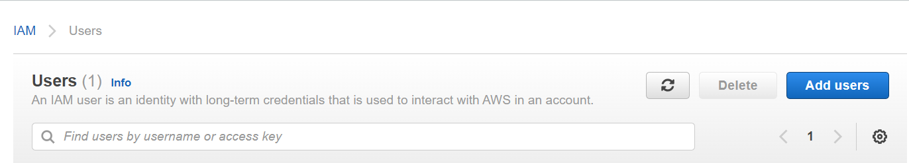
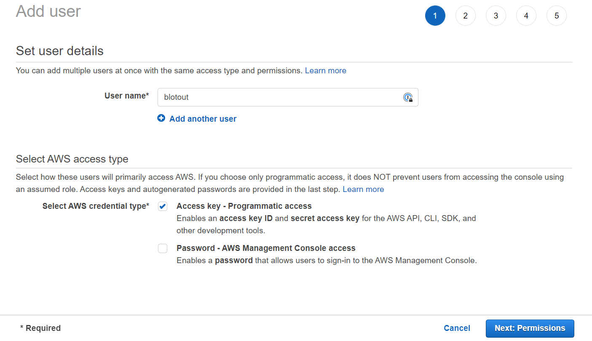
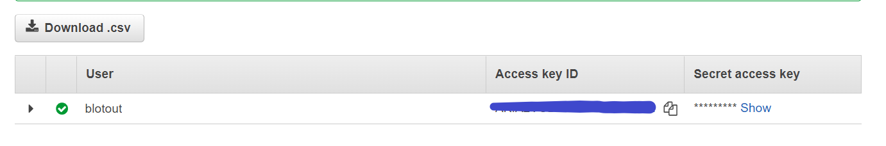

# AWS

To access AWS resources we require some credentials served by its access key and secret key. Below are the steps to create a user and its credentials. If you already have a user created (already have access key and a secret key) proceed to the step of creating [policies](./policies.md) for the user.

# Creating AWS user
1. Go to the AWS console and then click **IAM**.
2. In this click on **Add Users**. 
3. Give the username and Select **Access key - Programmatic access**. 
3. Click on **Next: Permissions**.
4. We will add the policies in the [next step](./policies.md).
5. Click on **Next: Tags**. Give any tags if you want to otherwise click on **Next: Review**.
6. In the next step click on **Create User**.
7. On the next page you will have **Access key** and **Secret key**. Copy the credentials and store them somewhere safe. 

## Next Steps
[Attaching permissions](./policies.md)