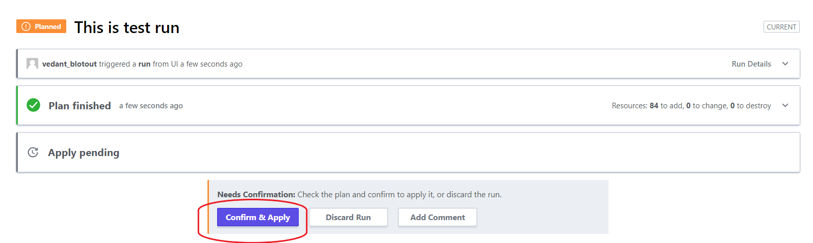

# Actions

Once we have created the **Terraform organization** with **workspaces** inside it and have attached the required values through the **Workspace variables** or a **Variable Set** we can start the action to provision the resources defined in the repo. This step actually provisions the infrastructure for you.

## Starting new run
1. Go to your **workspace** and then head over to Actions.
2. Click on **Actions** and **Start new run**. Give a reason/description and click **Start Run**. 
3. Once the plan is ready, you can click on **Confirm & Apply**. 
4. The plan can show what changes will occur once the plan gets executed. To look at these changes observe the drop down of the **Plan Changes**.
5. Once the run is finished resources for this workspaces are provisioned.

## Output
1. Once the run gets executed it is possible that output is recieved.
2. To get the output you can check it from the runs. 
3. You can also click on **Overview** to get the output