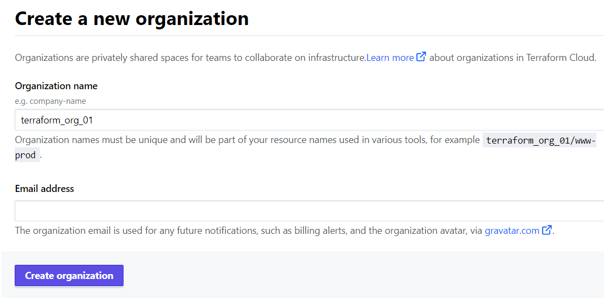

# Organization

Terraform organization is a logical differentiation between different kinds of Terraform workspaces. It is similar to companies in the real world where each company has different departements and is logically different from others. Moreover, by this example, we can conclude that workspaces are similar to different departmets in a company and combination of these workspaces results in a organization similar to different departments combining to form a company.

We can access organiztions in two ways. Either we can create the organiztion by ourselves or we can accept an invitation for an already created Terraform organization. Both the ways are expalined below -

## How to create a organization
1. Log in to [Terraform Cloud](https://app.terraform.io).
2. Move to [Create New Organization](https://app.terraform.io/app/organizations/new) page to create a new organization.
3. You need to enter your mail address and an unique orgnization name. 
4. Your new organization is now created. Next step is to create a new workspace.