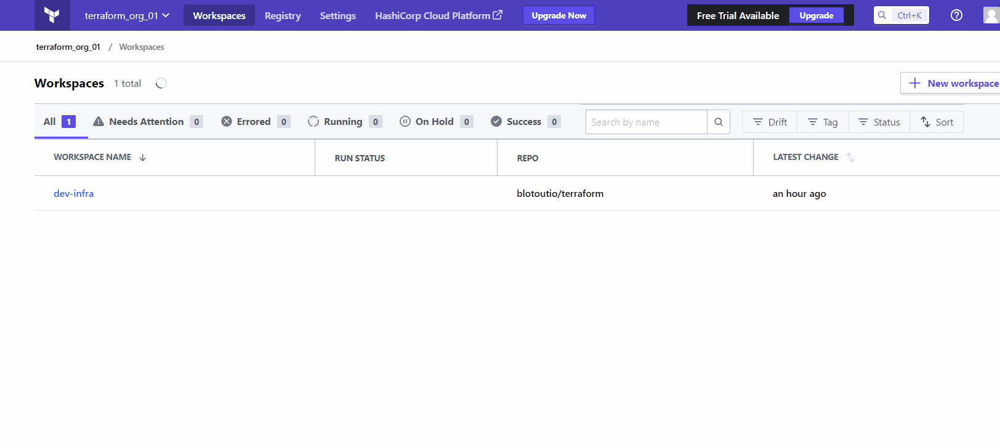
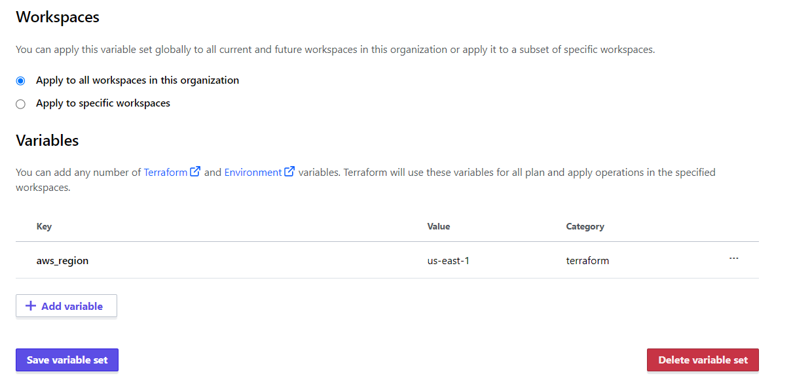
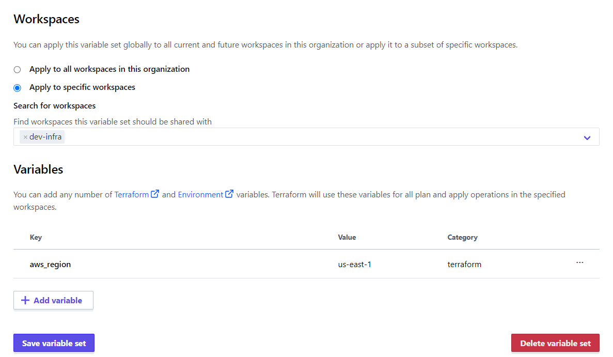

# Variable sets

Variable set are group of variables in a [Terraform organization](./organization.md) which can be applied to specific or all [Terraform workspaces](./workspace.md). Purpose of a variable set is to group together the variables which are common in workspaces and can be defined in a single place only. For e.g. If you have multiple workspaces using common variable `aws_region` then this variable can be created inside a variable set.

## Creating a Variable set
1. Go to your [Terraform organization](./organization.md) and click on **Settings**.
2. Click on **Variable Sets** and then **Create variable set**.
3. Give the variable set a name and then start adding variables to it.
4. Creating variables in a variable set is similar to creating [Workspace variables](./workspace_variables.md).
5. Save the variable set. 
6. If a variable is present in the workspace and the variable set then precedence is given to the [Workspace variables](./workspace_variables.md).

## Attaching a variable set
1. We can either select the variable set to be applied to all the workspace or to a specific one.
2. Go to **Variable Sets** in the **Settings** page.
3. Open your variable set and go to the **Workspaces** section.
4. Look at the image to attach the variable set in all workspaces. 
    - This attached these variables to all the workspaces present in the organization.
    - It is not a good practice to use this.
5. Look at the image to attach the variable set in specific workspaces. 
    - Only the workspaces mentioned will get the variable set.
    - It is a recommended practice
    - If you are not able to list the workspaces, start typing the initials of the workspaces and it will filter the required workspace for you.
6. Save the variable set.