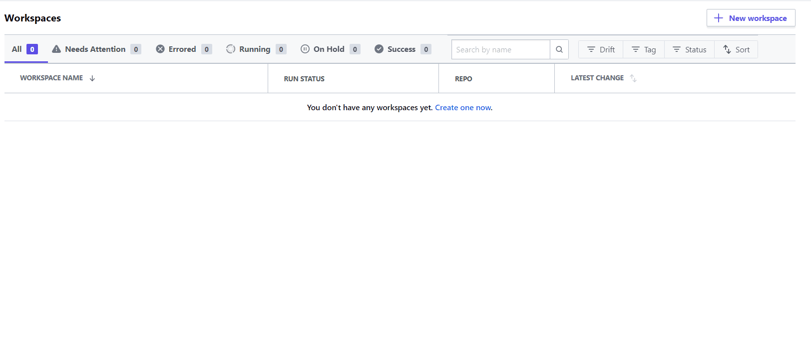

# Workspaces

Workspace is the place from where we create our infrastructure resources. By logically differentiating workspaces we can manage different resources of our entire infrastructure. For .e.g if we have multi-cloud infrastructure then we will create two different set of terraform files which will create the required resources in each cloud provider. Similarly to differentiate them in terraform cloud we can deploy them in two different workspaces.

Below we discuss how we can create a terraform workspace

## Creating a terraform workspace
1. Select your organization from the [Organization's](https://app.terraform.io/app/organizations) page.
2. Click on **+ New Workspaces** to create a new workspace.
3. Select the first workflow **Version Control workflow** to begin with.
4. You can connect to your repo from here. For this example we are using *Github* repo for this. Proceed with clicking on Github.
5. We are using **terraform** for this which we have already attached the repo. You can attach your own personal repo. For Blotout deployment we use this repo. 
6. Give a name to the workspace. Right now we will use a name called `dev-infra` which is relative to infrastructure deployment of our development environment.
7. In the advance options we select the path and the branch inside the repo from which we want to run the workspace Actions. For now we are using the path `/dev/infra` from the `master` branch in the `terraform` repo.
8. Click on **Create Workspace**. 