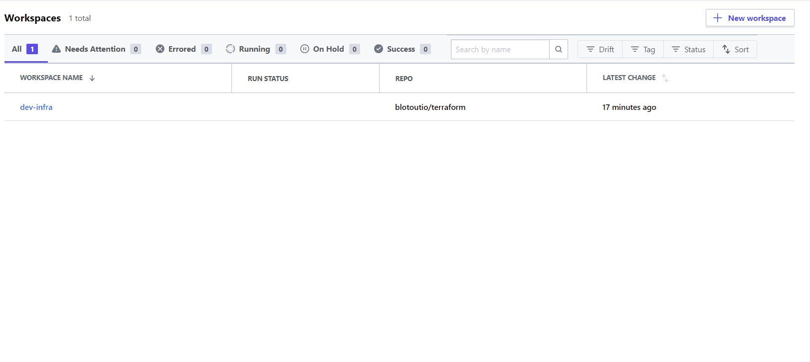
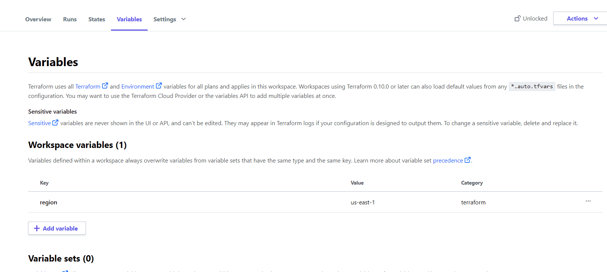
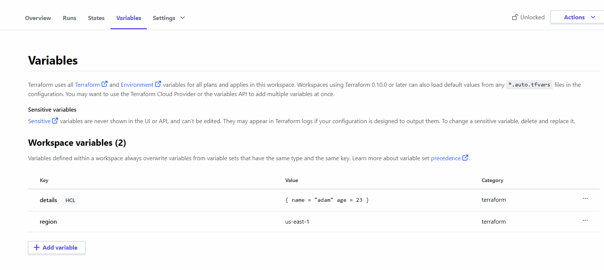
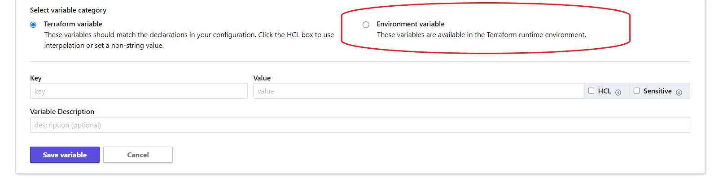

# Workspace Variables

There are two ways through which we can apply variable to a workspace. One way is to create a **Variable Set** which can be applied to a workspace and the other one is to create variables inside the workspace only.

## Create variable inside the workspace
1. Go inside the workspace and click on **Configure Variables**.
2. Write the `key` and the `value` in the respective fields.
3. All the variable are considered `string` by default. 
4. There are two options which we need to keep in mind. 
    - If we select `HCL` check box then the `value` will not be considerd as a string. It is generally used for integers or JSON objects. The type of the variable will be defined in the terraform file. 
    - If we select `Sensitive` then `value` becomes **write-only**. 
5. We can create environment variables also by selecting `Environment Variable` radio button in the `Select variable category`. 
